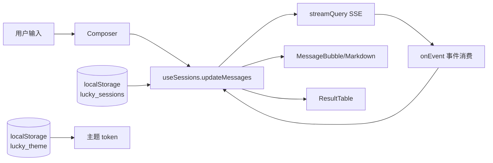

## 产品概述
将现有"电商问数"前端升级为 **Lucky** 通用智能助手界面（问数作为其核心能力之一），涵盖：全新视觉设计系统（亮/暗双主题、主流 AI 助手风格）、欢迎页能力卡片化、消息 Markdown 渲染与代码高亮、多会话历史侧栏、全量品牌更名（含 GitHub 仓库）。后端业务逻辑与 SSE 事件协议（00 §4 四类事件 + capability 字段）零改动，不为 skill+工具化预埋协议（渲染组件留扩展余地）。

## 核心功能
- **品牌更名 Lucky**：前端展示层（title/侧栏/欢迎页/手册）+ package.json + pyproject + README + 设计文档标题层 + GitHub 仓库改名
- **新视觉设计系统**：WorkBuddy 式主流 AI 助手风（大留白、气泡重设计、亮/暗主题切换、CSS variables 语义 token）
- **多会话历史侧栏**：会话列表（标题=首问截断、时间）、新建/切换/删除会话，localStorage 持久化，每会话独立 thread_id（后端 checkpointer 天然支持）
- **欢迎页能力卡片化**：问数技能卡片 + 能力预留位、示例问句多样化（闲聊/帮助/问数三类）、空态页通用化
- **消息渲染升级**：explanation/content 走 Markdown（表格/列表/代码块高亮），ResultTable 保持结构化渲染
- **去电商专属文案**：所有界面文案通用化


## 技术栈
- 保留：React 19 + TypeScript + Vite 6 + Tailwind 3.4 + pnpm（frontend/package.json name 改 lucky-frontend）
- 新增依赖（最小化，00 §8 红线内）：`react-markdown@^9` + `remark-gfm` + `rehype-highlight`（React 19 兼容已验证的主流组合，highlight.js 主题 CSS 双主题各引一份）

## 实现方案
### 主题系统（基建层）
- Tailwind `darkMode: "class"` + CSS variables 语义 token（--surface/--surface-2/--border/--text-1/2/3/--accent/--accent-soft），tailwind.config 用 `var()` 映射为语义色（surface/border-app/text-primary 等），替代现 parchment/ink 硬编码散布
- 主题状态：localStorage `lucky_theme` + `document.documentElement.classList.toggle("dark")`，默认跟随 `prefers-color-scheme`
- styles.css：移除 grain/网格纹理，重写为双主题 token 定义 + highlight.js 主题引入

### 多会话管理（数据层）
- `lib/sessionStore.ts`：sessions 持久化（localStorage `lucky_sessions`），结构 `{id: thread_id, title, createdAt, updatedAt, messages: ChatMessage[]}`；提供 list/create/remove/update/active 能力；`useSessions` hook 封装状态与切换逻辑
- 兼容迁移：检测旧 `agent_thread_id` sessionStorage → 转为首个会话条目
- 关键不变量：每个会话的 thread_id 首次创建后**不可变**（后端 checkpointer 依赖其延续上下文）；当前活跃会话的 messages 才进 App 渲染流

### 布局重构（表现层）
```
App.tsx（重构）
├── SessionSidebar      会话历史侧栏（Lucky 品牌 + 新会话 + 会话列表 + 删除 + 底部模型/API 状态）
├── Header              当前会话标题 + 主题切换 + 手册入口
├── MessageList         MessageBubble[]（Markdown 渲染）
├── EmptyState          能力卡片化欢迎页
└── Composer            保持既有模型弹层/芯片逻辑，文案通用化
```

### 数据流（不变量）
SSE 消费逻辑（streamQuery/onEvent/upsertStep）零改动；仅消息落点从单一 useState 变为 `useSessions.updateMessages(activeId, ...)`；模型/能力芯片偏好仍走 localStorage（02 文档语义不变）



## 注意事项
- MessageBubble 的 explanation 存储于 message.explanation（现有字段），Markdown 渲染器作用于 content 与 explanation 两处；result 仍走 ResultTable
- ManualPage 全屏手册文案同步通用化（保留组件形态）
- 依赖安装用 pnpm（packageManager pnpm@10.33.0 已锁定）


## 设计风格
参照 WorkBuddy/主流 AI 助手（Claude/ChatGPT）的新设计方向：**大留白 + 语义化双主题 + 克制的 accent**。

### 布局
- 三栏心智：左侧会话历史侧栏（264px，可折叠）｜中央消息流（max-w-3xl 居中，大留白）｜底部悬浮式 Composer（圆角大输入框，阴影分层）
- 欢迎页：Lucky logo（渐变圆角方块 + 四叶草意象图标）+ 一句定位语 + **能力卡片区**（"数据查询"实卡：图标+描述+示例问句入口；后续能力灰色预留卡）+ 三类示例问句 chips（闲聊/帮助/问数）
- 消息气泡重设计：用户消息右对齐浅 accent 圆角气泡；助手消息无气泡（全宽文本区，贴近主流助手），底部附 capability 徽标与模型名小字
- 侧栏会话项：标题截断 + 相对时间，hover 显删除，active 态 accent 左条

### 双主题
- Light：#FAFAF9 底 / 白色面板 / #1C1917 主字 / 靛蓝 #4F46E5 accent（Lucky 品牌渐变：#4F46E5→#7C3AED 用于 logo 与主按钮）
- Dark：#0F1117 底 / #171923 面板 / #E7E5E4 主字 / 同 accent 提亮 #818CF8
- Header 与侧栏同底色无边框分隔（靠留白分层），消息流区域微弱 surface-2 区分

### 交互
- 主题切换按钮（太阳/月亮）在 Header；切换即时 class 切换无闪烁（启动内联脚本防 FOUC）
- Markdown 代码块：rounded-lg 深色底 + 一键复制按钮；表格横向滚动
- 动效：消息入场 fade-slide 150ms、流式光标、按钮 hover 微移；尊重 prefers-reduced-motion

## Agent Extensions
### Skill
- **frontend-design**
  - Purpose: 在执行阶段为 Lucky 界面提供独特的视觉设计指导（避免模板化默认样式，确保新设计方向的品牌感）
  - Expected outcome: 主题 token、气泡与能力卡片的视觉规格经过设计审视，不落入通用 AI 界面俗套
### SubAgent
- **code-explorer**
  - Purpose: 执行阶段快速定位 Composer/EmptyState/ManualPage/MessageBubble 中的全部品牌字符串与 parchment/ink 硬编码色值清单
  - Expected outcome: 文案与色值改动点完整清单，避免遗漏
